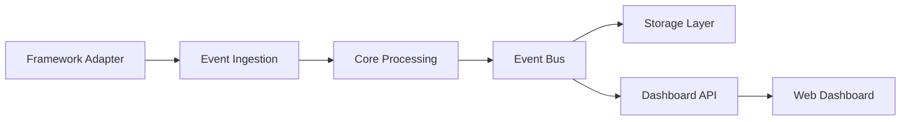

# Software Architecture Document

## 1. System Overview
Traceo is a self-hosted developer observability platform for Node.js applications. It collects structured runtime events, stores them in a pluggable persistence layer, and exposes them through a web dashboard and REST APIs.

## 2. Architecture Style
The system follows a modular, layered architecture with clear separation between ingestion, domain services, storage, and presentation.

## 3. Core Architectural Principles
- Separation of concerns
- Dependency inversion
- Plugin-based extensibility
- Secure defaults
- Low overhead instrumentation
- Event-driven processing

## 4. High-Level Components
- Ingestion layer: captures events from framework adapters and middleware
- Core domain layer: normalizes, validates, and correlates events
- Storage layer: persists events and metadata
- API layer: exposes dashboard and management endpoints
- Dashboard layer: renders activity and detailed event views
- Plugin layer: extends adapters, storage, and integrations

## 5. Runtime Flow
1. A framework adapter captures an application event.
2. The event is normalized by the core pipeline.
3. Sensitive data is masked.
4. The event is published to the event bus.
5. Subscribers process and persist the event.
6. The dashboard reads the data through the API layer.

## 6. Mermaid Diagram

## 7. Deployment Architecture
Traceo is intended to run as an embedded library within an application process, with optional standalone dashboard and storage services in future versions.

## 8. Security Architecture
- Authentication for dashboard access
- Authorization by role or scope
- Masking for secrets and personal data
- Safe defaults for production environments

## 9. Extension Points
- Framework adapters
- Storage adapters
- Authentication providers
- Plugin hooks
- Dashboard modules

## 10. Technology Decisions
- TypeScript for type safety and ecosystem compatibility
- Node.js as the runtime platform
- SQLite as the default storage backend for early releases
- Event-driven processing for decoupling
